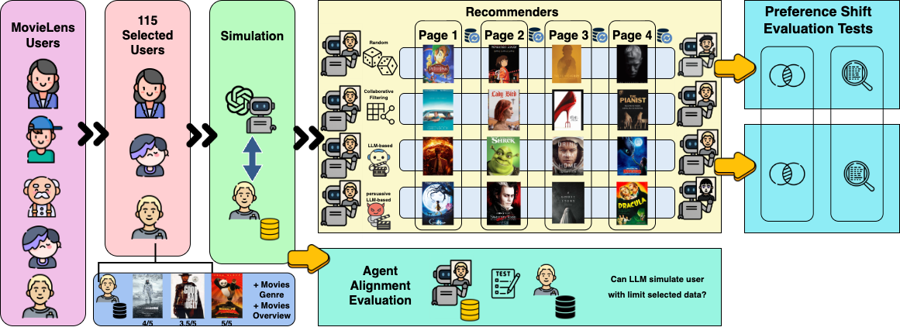

<div align=center>
<!-- <h1>Avatar: Agent-based Virtual Approach to Large Scale Recommendation Simulation</h1> -->

<h1>Modeling Preference Shift: LLM-Based Simulation for Measuring Preference Dynamics in Recommender Systems</h1>



</div>

# Introduction:
This repository contains the source code and data of our paper `Modeling Preference Shift: LLM-Based Simulation for Measuring Preference Dynamics in Recommender Systems`.
You can find the final results in `/simulation_results/results/`. 

The initial data, including our manually selected user cohort can be found in `/data/`.
The processed users(along with their movies metadata from [TMDB](https://www.themoviedb.org/) and its [API](https://developer.themoviedb.org/docs/getting-started)) is devided in 5 directories to enable multi-processing to prevent any interference.

#  Preparations

## 1.Download the dataset
To download the data, please do this step by step:
1. From the source to the root of the project, please cd to `/data/`
2. Run the following code in the terminal:
```
curl -L -o data.zip https://files.grouplens.org/datasets/movielens/ml-32m.zip
```
or manually download MovieLens 32M from [here](https://grouplens.org/datasets/movielens/32m/) and paste it in `/data/`
3. Unzip the downloaded file:
```
unzip data.zip
```
4. Verify CSV files are extracted in `/data/ml-32m/`

## 2. Install requirements.txt

Set up a virtualenv. After that, install all the dependencies listed in the `requirements.txt` file by running the following command:

```
pip install -r requirements.txt
```

Our experiments have been tested on Python 3.12.3.

## 3. Set up recommendar

A movie recommender system using Movie-lens dataset.

### How to setup
Create a new virtualenv and use python 3.12. (The need for new venv is mandatory.)

First, go inside this path 

```
cd source_code/recommender/
```

Firstly, install required libraries:

```
pip install -r requirements.txt
```

(This should be `/source_code/recommender/requirements.txt` file.)

This recommender, uses `numpy==1.26.4`. This is why you need to set up a new venv for that.

Then, download and unzip the MovieLens 32M and unzip it in the path `/source_code/recommender/`.

To build models, run `Build_model.py`:

```
python Build_model.py
```

Finally, to get recommendations:
```
python recommend.py
```

### Tips

1. You can change number of recommendations in `recommend.py`.
2. The input file format is `.csv` with a column of `userId`.
3. Change the input and output file paths in `recommend.py` if needed.
4. Consider in mind that this process takes a huge amount of memory, more than 30GB of RAM in some points. This is the result of huge data size.

## 4. Set up the environment
Create a `.env` file in the main directory, beside `main.py`.
Put these content in it:

```
API_KEY = <YOUR_OPENROUTER_API_KEY>
BASE_URL = "https://openrouter.ai/api/v1"
SIMULATOR_LLM_NAME = "openai/gpt-5"
RESULTS_DIRECTORY = "simulation_results/results/"
TMDB_API_KEY = <YOUR_TMDB_API_KEY>
RECOMMENDER_LLM_NAME = "openai/gpt-5"
TEMPERATURE_SIM = 0.3
TEMPERATURE_REC = 0.7
PROXY_SERVER = "https://api.themoviedb.org"

```


## Run Simulation
Based on how much multi-processing you want to use, first split the users and put them in `data/users_{id}`.
As you can see, we have done this and split our users into 5 directories.
Then, you can use the following command:

```
python parallel_runner.py <id> <YOUR_OPENROUTER_API_KEY> <YOUR_TMDB_KEY>
```
You can run this command several times to create multiple instances.

you can use different openrouter tokens and TMDB api keys for each instance. (You MUST input your token as arguemnt.)